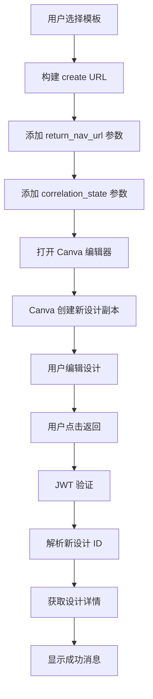

# Brand Template 完整流程说明

## 🔄 完整流程解析

### 1. 初始状态
- 用户访问 Brand Template Creator 页面
- 系统加载用户的品牌模板列表
- 用户选择一个或多个模板

### 2. 创建过程
```
用户点击"创建设计副本"
    ↓
系统构建带有 return navigation 的 URL：
https://www.canva.cn/design?create=true&template=EAGsBIYXsh8&return_nav_url=...&correlation_state=...
    ↓
打开新的 Canva 编辑器窗口
    ↓
Canva 创建新的设计副本（基于模板）
    ↓
用户获得新的设计 ID（如：DAG0QACYBWY）
    ↓
用户编辑设计
```

### 3. 返回过程
```
用户完成编辑，点击"返回"按钮
    ↓
Canva 重定向到：http://127.0.0.1:3001/return-nav?correlation_jwt=...
    ↓
后端验证 JWT 并解析设计 ID
    ↓
前端获取新创建的设计详情
    ↓
显示成功消息和设计信息
```

## 🎯 关键理解点

### ✅ 正常行为
1. **Brand Template → 新设计**：这是预期的行为
2. **新设计有新的 ID**：每个副本都是独立的设计
3. **Return Navigation 仍然有效**：会返回新创建的设计信息

### 🔍 URL 变化说明
```
原始模板 URL：
https://www.canva.cn/design?create=true&template=EAGsBIYXsh8

创建后的新设计 URL：
https://www.canva.cn/design/DAG0QACYBWY/nRdDBzq5ZZRX0-pdvv5Ezw/edit

这是正常的！新设计有自己的 ID 和编辑 URL。
```

## 📋 实际测试步骤

### 1. 准备测试
```bash
# 确保应用运行
npm run demo:ecommerce

# 访问页面
http://127.0.0.1:3000/brand-template-creator
```

### 2. 执行测试
1. **连接 Canva**：点击 "Connect to Canva" 进行授权
2. **选择模板**：选择一个品牌模板
3. **创建副本**：点击 "创建设计副本"
4. **观察 URL**：注意 URL 从模板 URL 变为新设计 URL
5. **编辑设计**：在 Canva 中进行一些编辑
6. **点击返回**：在 Canva 中点击返回按钮
7. **验证返回**：确认返回到应用并显示成功消息

### 3. 预期结果
- ✅ 成功创建新设计副本
- ✅ 新设计有独立的 ID
- ✅ Return Navigation 正常工作
- ✅ 应用显示设计详情

## 🛠️ 高级功能扩展

### 1. 设计历史记录
```typescript
// 保存创建的设计历史
const saveDesignHistory = (designDetails: DesignDetails) => {
  const history = JSON.parse(localStorage.getItem('designHistory') || '[]');
  history.push(designDetails);
  localStorage.setItem('designHistory', JSON.stringify(history));
};
```

### 2. 批量设计管理
```typescript
// 管理多个创建的设计
const [createdDesigns, setCreatedDesigns] = useState<DesignDetails[]>([]);

const handleDesignCreated = (design: DesignDetails) => {
  setCreatedDesigns(prev => [...prev, design]);
};
```

### 3. 设计状态跟踪
```typescript
// 跟踪设计状态
type DesignStatus = 'created' | 'editing' | 'completed' | 'exported';

const trackDesignStatus = (designId: string, status: DesignStatus) => {
  // 更新设计状态
};
```

## 🔧 故障排除

### 问题：Return Navigation 不工作
**可能原因：**
1. URL 中没有 `return_nav_url` 参数
2. Developer Portal 中未启用 Return Navigation
3. JWT 验证失败

**解决方案：**
```typescript
// 检查 URL 格式
const url = new URL(createUrl);
console.log('Return nav URL:', url.searchParams.get('return_nav_url'));
console.log('Correlation state:', url.searchParams.get('correlation_state'));
```

### 问题：设计 ID 不匹配
**说明：** 这是正常行为！Brand Template 创建的是新设计，会有新的 ID。

**验证方法：**
```typescript
// 在 return navigation 中验证
const returnedDesignId = parsedJwt.design_id; // 这是新创建的设计 ID
const originalTemplateId = correlationState.selectedTemplates[0]; // 这是原始模板 ID

console.log('原始模板 ID:', originalTemplateId);
console.log('新创建的设计 ID:', returnedDesignId);
// 这两个 ID 不同是正常的！
```

## 📊 完整的数据流



## 🎉 总结

Brand Template API 的工作流程是：
1. **模板** → **新设计副本**（正常行为）
2. **新设计** 有自己的 ID 和 URL（预期结果）
3. **Return Navigation** 返回新设计的信息（功能正常）

这个流程完全符合 Canva API 的设计理念，每个模板副本都是独立的设计，可以单独管理和编辑。
